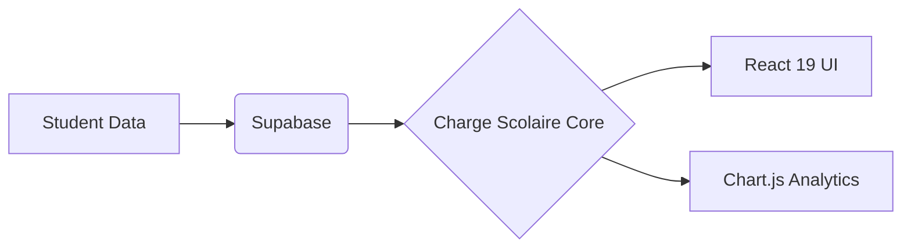

<div align="center">
  <br />
  
  
  <br />
  
  <a href="https://react.dev">
    
  </a>
  <a href="https://vitejs.dev">
    
  </a>
  <a href="https://supabase.com">
    
  </a>
  <a href="https://www.chartjs.org">
    
  </a>

  <br />
  <br />

  <p align="center">
    <b>Smart Dashboard</b> • <b>Predictive Grades</b> • <b>Cloud Sync</b>
  </p>
</div>

<br />

<div align="center">
  <table>
    <tr>
      <td align="center" width="50%">
        <h1>📊</h1>
        <h3>Omni-Dashboard</h3>
        <p>Unified view of your academic life.<br/>Grades, tasks, and schedule in sync.</p>
      </td>
      <td align="center" width="50%">
        <h1>🔮</h1>
        <h3>Predictive Engine</h3>
        <p>Simulate future grades.<br/>Know exactly what you need to score.</p>
      </td>
    </tr>
    <tr>
      <td align="center" width="50%">
        <h1>⚡</h1>
        <h3>Instant UX</h3>
        <p>Zero latency interactions.<br/>Built for speed with Vite.</p>
      </td>
      <td align="center" width="50%">
        <h1>🔐</h1>
        <h3>Private Cloud</h3>
        <p>Secure authentication & storage<br/>powered by Supabase.</p>
      </td>
    </tr>
  </table>
</div>

<br />

## ⚡ The Stack

This project is an exploration of modern frontend architecture, moving away from "just displaying data" to **interpreting it**.



## 🚀 Quick Start

```bash
# 1. Clone the repo
git clone https://github.com/zay168/charge-scolaire.git

# 2. Key in
cd charge-scolaire
npm install

# 3. Liftoff
npm run dev
```

---

<div align="center">
  
</div>